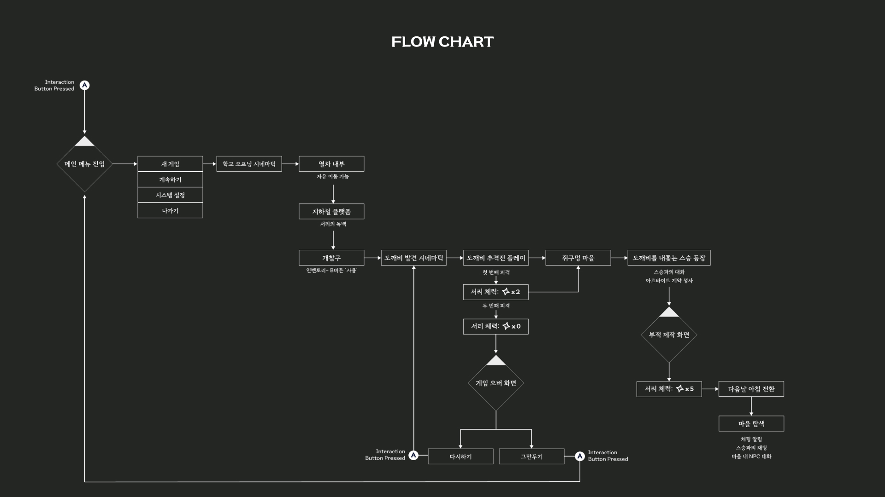

# 🏮 미신전 (未信殿)

## 📝 개요

> 쥐구멍 마을의 수수께끼를 풀어가는 어드벤처 게임
> 




---

## 🛠 개발 환경

- Unreal Engine 5.x
- Visual Studio 2022
- C++, Blueprint

---

## **📅 개발 기간**

1. 09. 02 ~ 2024. 10. 28

---

## 😀 개발 인원

- 개발 : 2인
    - 레벨, UI, 적 중심의 기능 개발
    - 플레이어, NPC 중심의 기능 개발
- 디자인 : 3인
    - 배경 디자이너
    - 캐릭터 디자인 및 애니메이터
    - UI/UX 디자이너

---

## ✅ 담당 기능

- 플레이어 상호작용
    - 아이템 줍기
    - NPC 대화
    - 문 열기
- 캐릭터/NPC 애니메이션 전환
- 스토리 진행에 따른 대사 표현

---

## 💻 기능구현

- **플레이어 상호작용**
    
     플레이어가 상호작용이 가능한 대상 [NPC, 아이템, 고정 물체]의 상호작용 범위에 들어가게 되었을 때 상호작용 키를 통해 대상에 지정된 상호작용 이벤트를 수행하는 방식으로 구현하였습니다.
    
    ```cpp
    // 가능한 대상의 타입에 따라 플레이어에서 수행해야하는 다른 동작 구분을 위해 
    // 타입을 enum으로 따로 지정하여 구분하게 하였습니다.
    UENUM(BlueprintType)
    enum class InteractType : uint8 {
    	NONE UMETA(DisplayName = "None"),
    	STATIC UMETA(DisplayNmae = "Static"),
    	ITEM UMETA(DisplayNmae = "Item"),
    	NPC UMETA(DisplayName = "NPC")
    };
    
    // 상호작용과 관련된 인터페이스를 별도로 생성하여 NPC, 아이템, 고정 물체에서 구현하게
    // 코드를 작성하였습니다.
    UINTERFACE(MinimalAPI)
    class UInteractable : public UInterface
    {
    	GENERATED_BODY()
    };
    
    class Y2S3_MISINJEON_API IInteractable
    {
    	GENERATED_BODY()
    protected:
    	InteractType type = InteractType::NONE;
    public :
    	InteractType  virtual getType() { return type; };
    	void virtual Interact() {};
    };
    ```
    
    ```cpp
    // NPC
    class Y2S3_MISINJEON_API ANPC : public AActor, public IInteractable, public IConversation
    
    // Item
    class Y2S3_MISINJEON_API AItem : public AActor, public IInteractable
    
    //Static
    class Y2S3_MISINJEON_API AStatic : public AActor, public IInteractable
    ```
    
     이렇게 하여서 플레이어에서는 타입별 따로 동작이 필요한 부분을 수행 후 Interact를 호출 하게하여 확장성과 유지보수성을 키웠습니다. 
    
     또한, 레벨에 실제로 배치되는 BP_액터들은 각 C++로 작성된 NPC, Item, Static 클래스를 상속하고 있어 각 액터의 이름과 3D Mesh의 종류만 변경하여 배치하여서 새로운 NPC, 아이템, 고정 물체의 추가가 용이하였습니다.
    
    ```cpp
    // 플레이어 코드 중 상호작용 시 실행되는 코드
    InteractType type = targetInteract->getType();
    
    switch (type)
    {
    case InteractType::NONE: {
    	//UE_LOG(LogTemp, Log, TEXT("This is Exception"));
    	break;
    	}
    case InteractType::STATIC: {
    	//UE_LOG(LogTemp, Log, TEXT("Interact Static"));
    	break;
    	}
    case InteractType::ITEM:{
    	// 인벤토리에 추가 or 인벤토리가 꽉찼습니다 처리
    	AItem* item = Cast<AItem>(targetInteract);
    	for (int i = 0; i < INVENTORY_SIZE; i++) {
    		if (inventory[i] != -1) continue;
    		inventory[i] = item->getItemKey();
    		break;
    	}
    	break;
    	}
    case InteractType::NPC:{
    	// 대화하기
    	ANPC* npc = Cast<ANPC>(targetInteract);
    	// 카메라 좌표 구하기
    	FVector cameraPos = npc->getCameraPos();
    	FVector LookPos = (npc->GetActorLocation() + GetActorLocation()) * 0.5f;
    	FRotator lookRotation = UKismetMathLibrary::FindLookAtRotation(cameraPos,LookPos);
    
    	//FVector seoriPos = npc->getSeoriPos();
    	RestCameraPos = PlayerCamera->GetComponentLocation();
    	Talking = true;
    
    	TalkStart(cameraPos, lookRotation);
    	break;
    	}
    }
    targetInteract->Interact();
    ```
    

---

- **캐릭터 / NPC 애니메이션 전환**
    - 플레이어
    
    유저의 조작 상태에 따라 플레이어 상태를 변경하고 그에 맞는 플레이어 애니메이션을 실행하는 블루프린트와 애니메이션 그래프
    
    
    
    
    
    - NPC
    
    NPC의 대화 상태에 따라 듣는 애니메이션과 말하는 애니메이션을 실행하게 하는 블루프린트와 애니메이션 그래프
    
    
    
    
    

---

- **스토리 진행에 따른 대사 표현**
    
     대사를 구현할 때 동일한 위치에 있을 때여도 시간과 스토리의 진행에 따라 나와야하는 대사가 달라야 하기 때문에 데이터 테이블에서 행이름을 chap/level/index로 지정하여 블루프린트에서 구분할 수 있게 하였습니다.
    
    
    
    ※ chap/level/index를 활용하여 현재 스크립트를 데이터 테이블에서 찾아서 반환하는 함수
    
    
    
    chap/level/index는 gamemode에서 관리하고, 대화를 이어가거나 맵을 이동하게 될 때 index와 level을 변경하게 됩니다.
    <div>
        </img>
        </img> 
    </div>

---

## 📝배운 점

 Unreal Engine을 통해 게임 개발 시 객체 지향적으로 작성할려면 어떻게 해야할지를 고민하고, 인터페이스와 상속을 어떻게 활용하여야 하는지  배울 수 있는 프로젝트였습니다. 무작정 개발을 하기 전에 클래스 간의 관계를 어떻게 할 것인지 고민하고, 구현하여야 하는 것이 확장성 및 유지 보수에 도움이 되는 것을 배웠습니다.

 그리고 처음으로 디자이너와 함께 협력하여 게임을 개발하는 좋은 경험이 되었습니다. 이 과정에서 비전공자와의 소통에서 어떻게 하여야 개발자의 의견을 비전공자에게 정확히 전달할 수 있을까를 고민할 수 있는 경험을 하였고, 전문 용어를 제외하고 그림과 예시를 사용하여 의견을 전달하는 방법을 배울 수 있었습니다.